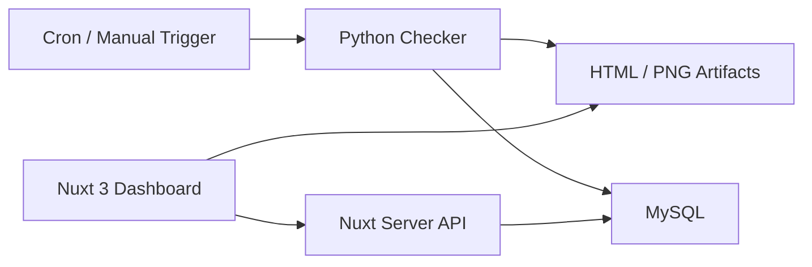

# Server Checker Dashboard Roadmap

เอกสารนี้สรุปแนวทางต่อยอดโปรเจกต์ `server-checker` ให้เป็น web dashboard โดยยังใช้ Python checker เดิมต่อได้

## สถานะปัจจุบันของโปรเจกต์

ตอนนี้ repo นี้มี 3 ส่วนที่ดีอยู่แล้ว

- SSH checker สำหรับ service checks
- Playwright checker สำหรับ web screenshot / login flow
- HTML report generator พร้อม screenshot artifact

ดังนั้นสิ่งที่ควรเพิ่มไม่ใช่การเขียน checker ใหม่ แต่เป็นชั้น `database + API + dashboard`

## สถาปัตยกรรมที่แนะนำ

แนะนำใช้แบบนี้

- `Python checker` รับผิดชอบ run checks, เก็บ log, สร้าง HTML report, และเขียนผลลง MySQL
- `MySQL 8` เก็บ run history, service status, step details, web results, report paths
- `Nuxt 3` ทำ UI dashboard
- `Nuxt server API (Nitro)` อ่านข้อมูลจาก MySQL แล้วส่งให้หน้า dashboard



## ทำไมแนวนี้เหมาะกับ repo นี้

- ไม่ต้องย้าย logic SSH/Playwright ไป Node ใหม่
- dashboard อ่านจาก DB ได้เร็วกว่าไป parse ไฟล์ HTML ตลอดเวลา
- run checker ผ่าน cron หรือ systemd timer แบบเดิมได้
- ต่อ alerting ภายหลังได้ง่าย เช่น LINE, Slack, email

## Frontend ที่แนะนำ

ถ้าคุณอยากใช้ Nuxt ผมแนะนำแบบนี้

- `Nuxt 3`
- `Nitro server routes` สำหรับทำ API ในโปรเจกต์เดียวกับ frontend
- `MySQL 8` เป็นฐานข้อมูลหลัก
- ฝั่ง Nuxt ใช้ `mysql2` ตรง ๆ ก่อน หรือจะใช้ `drizzle-orm` ตอนระบบเริ่มใหญ่ก็ได้

สำหรับ phase แรก ผมแนะนำให้ `Nuxt` เป็น dashboard + read API ก่อน
ส่วนการรัน checker จริงให้ Python เป็น worker แยกออกมา

## API ที่ควรมีใน phase แรก

### Dashboard summary

- `GET /api/dashboard/summary`
- return จำนวน services ทั้งหมด, fail ล่าสุด, web fail ล่าสุด, last run time

### Run history

- `GET /api/runs?limit=20&status=FAIL`
- `GET /api/runs/:runKey`

### Service status

- `GET /api/services/latest`
- `GET /api/services/:serviceResultId`
- `GET /api/services/:serviceResultId/steps`

### Web checks

- `GET /api/web-checks/latest`
- `GET /api/web-checks/:webResultId`

### Trigger

- `POST /api/runs/trigger`
- เรียก shell command หรือ queue job เพื่อสั่ง Python checker รันแบบ manual

## โครงหน้า dashboard ที่ควรทำ

- หน้า `Overview`
  แสดง last run, total fail, services fail ตาม site, web fail list

- หน้า `Runs`
  ดูประวัติการรันย้อนหลัง, filter ตามวัน/สถานะ/site

- หน้า `Services`
  ดู latest status ของทุก service, drill down ไปถึง step/output ได้

- หน้า `Web Checks`
  ดู screenshot ล่าสุด, final URL, error message

- หน้า `Reports`
  เปิด HTML report และ PNG ที่ระบบ generate ไว้

## โครง Nuxt ที่แนะนำ

```text
nuxt-dashboard/
  pages/
    index.vue
    runs/index.vue
    runs/[runKey].vue
    services/index.vue
    services/[serviceResultId].vue
    web-checks/index.vue
    reports/index.vue
  server/
    api/
      dashboard/summary.get.ts
      runs/index.get.ts
      runs/[runKey].get.ts
      runs/trigger.post.ts
      services/latest.get.ts
      services/[serviceResultId].get.ts
      services/[serviceResultId]/steps.get.ts
      web-checks/latest.get.ts
      web-checks/[webResultId].get.ts
```

## Database ที่แนะนำ

ถ้าคุณต้องการใช้ MySQL ตาม infra เดิมของทีม ให้ใช้ `MySQL 8` ได้เลย

### เพราะอะไรไม่แนะนำ SQLite เป็นตัวหลัก

- ตอนแรกใช้ได้ แต่พอมี run history เยอะ query dashboard จะเริ่มตัน
- concurrent access จาก worker + dashboard API จัดการยากกว่า
- งาน report/filter หลายหน้าเริ่มดูแลยาก

### ทำไม MySQL 8 ยังพอสำหรับ phase นี้

- ข้อมูลของโปรเจกต์นี้เป็นเชิง relational มากกว่า time-series ล้วน ๆ
- สิ่งที่ต้อง query หลักคือ site, host, service, status, report path
- MySQL ตัวเดียวเอาอยู่ใน phase แรกถึงกลาง

## สิ่งที่ schema รอบนี้รองรับแล้ว

ไฟล์ schema อยู่ที่ [database/mysql/001_init.sql](/Users/macbookpro/server-checker/database/mysql/001_init.sql)

- เก็บ run แต่ละรอบ
- เก็บ service result และแต่ละ check step
- เก็บ web check result
- เก็บ report paths ที่ Python สร้างไว้
- เก็บ raw payload เป็น `JSON` เพื่อรองรับการเปลี่ยน format ในอนาคต

## วิธีพัฒนาต่อเป็นลำดับ

1. ใช้ MySQL schema ที่เพิ่มไว้ก่อน
2. ให้ Python checker เขียนผลลง DB ทุกครั้งหลังรัน
3. สร้าง Nuxt dashboard อ่านจาก view `latest_service_status_v` และ `latest_web_status_v`
4. ค่อยเพิ่ม manual trigger, auth, alerting

## ถ้าจะให้ผมทำต่อรอบถัดไป

ผมแนะนำ 2 ทางที่คุ้มที่สุด

1. ผม scaffold โปรเจกต์ `Nuxt 3 dashboard` ให้เลย พร้อม API routes อ่าน MySQL
2. ผมเพิ่ม `FastAPI` แยกอีกตัวสำหรับ trigger/check management ถ้าคุณอยากแยก backend ชัดเจน

ถ้าคุณอยากไปทาง Nuxt เต็มตัว รอบถัดไปผมช่วยขึ้นโครง `nuxt-dashboard` ให้ต่อได้ทันทีครับ
